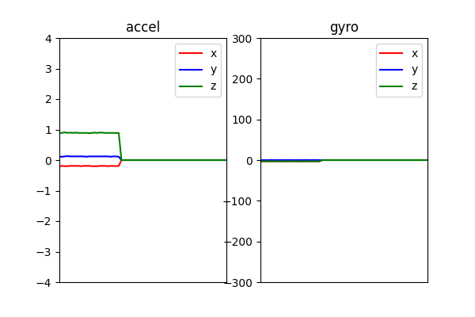

# start

## 1:ハード側の準備


## 2:ライブラリをインストール
```shell 
pip3 install -r requirements.txt
```

## 3:testフォルダ内のプログラムを試す

#### ・I2C_test.pyを動かす。成功例↓

```shell
【加速度】x:-0.16 y:0.12 z:0.90【角速度】x:-4.99 y:1.56 z:-3.24【ライト】0
【加速度】x:-0.16 y:0.12 z:0.91【角速度】x:-2.86 y:0.37 z:-3.11【ライト】0
【加速度】x:-0.16 y:0.12 z:0.89【角速度】x:-2.53 y:-0.07 z:-3.00【ライト】0
【加速度】x:-0.16 y:0.12 z:0.90【角速度】x:-4.99 y:1.56 z:-3.24【ライト】0
【加速度】x:-0.16 y:0.12 z:0.91【角速度】x:-2.86 y:0.37 z:-3.11【ライト】0
【加速度】x:-0.17 y:0.12 z:0.91【角速度】x:-2.95 y:0.22 z:-3.08【ライト】1
【加速度】x:-0.17 y:0.12 z:0.90【角速度】x:-2.82 y:0.20 z:-2.73【ライト】1
【加速度】x:-0.16 y:0.11 z:0.90【角速度】x:-3.03 y:0.21 z:-2.86【ライト】1
...
```

#### ・draw_graph.pyを動かす。成功例↓



#### ・適当な動画を録画した後、settings.toml内のVIDEO_DIRを書き換え、move_videodir.pyを動かす

dataフォルダ内に録画した動画が入っていれば成功。

## 4:main.pyを動かす
