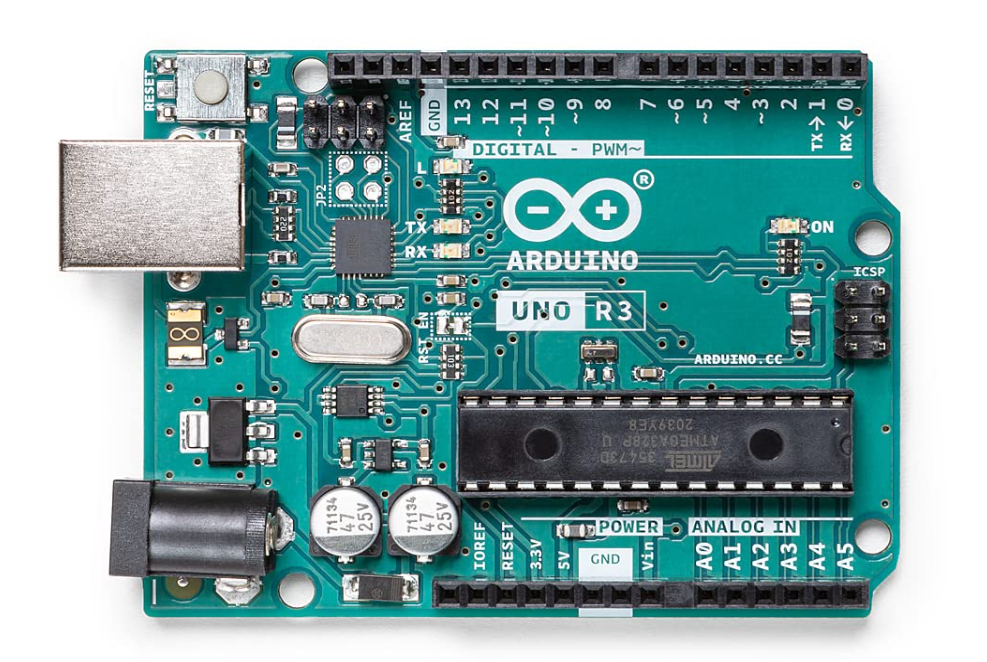
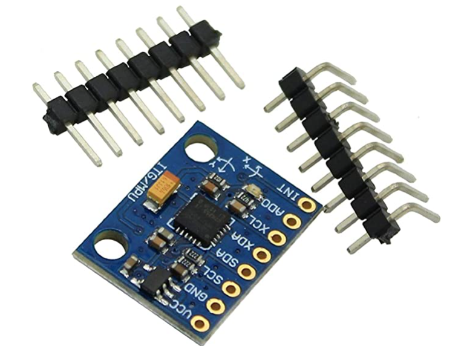

# start

## 1:ライブラリをインストール
```shell 
pip3 install -r requirements.txt
```

## 2:ハード側の準備



## 3:IC2test.pyを動かして

```shell
【加速度】x:-0.16 y:0.12 z:0.90【角速度】x:-4.99 y:1.56 z:-3.24【ライト】0
【加速度】x:-0.16 y:0.12 z:0.91【角速度】x:-2.86 y:0.37 z:-3.11【ライト】0
【加速度】x:-0.16 y:0.12 z:0.89【角速度】x:-2.53 y:-0.07 z:-3.00【ライト】0
【加速度】x:-0.16 y:0.12 z:0.90【角速度】x:-4.99 y:1.56 z:-3.24【ライト】0
【加速度】x:-0.16 y:0.12 z:0.91【角速度】x:-2.86 y:0.37 z:-3.11【ライト】0
【加速度】x:-0.17 y:0.12 z:0.91【角速度】x:-2.95 y:0.22 z:-3.08【ライト】1
【加速度】x:-0.17 y:0.12 z:0.90【角速度】x:-2.82 y:0.20 z:-2.73【ライト】1
【加速度】x:-0.16 y:0.11 z:0.90【角速度】x:-3.03 y:0.21 z:-2.86【ライト】1
【加速度】x:-0.16 y:0.12 z:0.91【角速度】x:-3.02 y:0.31 z:-2.83【ライト】1
【加速度】x:-0.16 y:0.12 z:0.89【角速度】x:-2.99 y:0.43 z:-2.91【ライト】1
【加速度】x:-0.17 y:0.12 z:0.90【角速度】x:-3.92 y:0.63 z:-3.07【ライト】0
【加速度】x:-0.16 y:0.12 z:0.90【角速度】x:-3.61 y:0.39 z:-2.97【ライト】0
【加速度】x:-0.16 y:0.11 z:0.90【角速度】x:-2.74 y:0.00 z:-2.91【ライト】0
【加速度】x:-0.16 y:0.11 z:0.90【角速度】x:-3.05 y:0.31 z:-2.97【ライト】0
```

みたいに出力されれば準備完了

## 4:main.pyを動かす

dataフォルダ直下に実験の時刻が書かれたフォルダが作成される。
そしてその中にcsvとmp4ファイルが作成されていれば成功。
